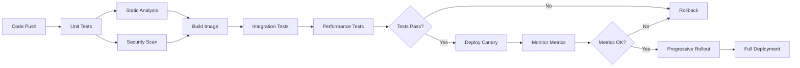

# Cloud-Native AG06 Mixer Architecture

## Overview

This document describes the cloud-native architecture implementation for the AG06 Audio Mixer, following best practices from Google, Meta, Netflix, and other leading tech companies.

## Architecture Principles

### 1. **Microservices Architecture**
- **Service Decomposition**: Audio processing separated into discrete services
- **gRPC Communication**: High-performance RPC using Protocol Buffers
- **Service Mesh**: Istio for advanced traffic management and security
- **API Gateway**: Unified entry point with rate limiting and authentication

### 2. **Observability (Three Pillars)**

#### Metrics
- **Prometheus**: Time-series metrics collection
- **Custom Metrics**: Business-specific KPIs (LUFS, genre detection accuracy)
- **RED Method**: Rate, Errors, Duration for all services
- **USE Method**: Utilization, Saturation, Errors for resources

#### Logging
- **Structured Logging**: JSON format with correlation IDs
- **Centralized Aggregation**: Fluentd → Elasticsearch → Kibana
- **Log Levels**: Dynamic adjustment without restart
- **Sampling**: Intelligent sampling for high-volume logs

#### Tracing
- **OpenTelemetry**: Vendor-agnostic distributed tracing
- **Trace Context Propagation**: W3C Trace Context standard
- **Span Attributes**: Rich metadata for debugging
- **Tail-based Sampling**: Keep interesting traces

### 3. **Reliability Engineering**

#### Circuit Breakers
```python
class CircuitBreaker:
    states = ["CLOSED", "OPEN", "HALF_OPEN"]
    failure_threshold = 5
    timeout = 60 seconds
    success_threshold = 2
```

#### Retry Logic
- **Exponential Backoff**: 2^n * base_delay
- **Jitter**: Random delay to prevent thundering herd
- **Circuit Breaker Integration**: Skip retries when circuit is open
- **Idempotency**: Safe retries with idempotency keys

#### Rate Limiting
- **Token Bucket Algorithm**: Smooth rate limiting with burst capacity
- **Per-User Quotas**: Fair resource allocation
- **Adaptive Limits**: Based on system load
- **Graceful Degradation**: Prioritize critical requests

### 4. **Progressive Delivery**

#### Feature Flags
```yaml
flags:
  ai_mixing_v2:
    rollout: 20%  # Gradual rollout
    overrides:
      - user_group: beta -> 100%
      - region: us-west -> 50%
  
  advanced_effects:
    rollout: 100%
    kill_switch: true  # Emergency disable
```

#### Canary Deployments
- **Traffic Splitting**: 5% → 10% → 25% → 50% → 100%
- **Automated Rollback**: Based on error rate and latency
- **Shadow Traffic**: Test new versions without impact
- **Blue-Green Deployments**: Instant rollback capability

#### A/B Testing
- **Model Versioning**: Multiple ML models in production
- **Consistent Hashing**: Stable user assignment
- **Statistical Significance**: Automatic winner detection
- **Experiment Isolation**: No interaction between tests

### 5. **Security**

#### Zero Trust Architecture
- **mTLS Everywhere**: Service-to-service encryption
- **JWT Authentication**: Stateless authentication
- **RBAC**: Fine-grained authorization policies
- **Network Policies**: Microsegmentation

#### Secret Management
- **Google Secret Manager**: Centralized secret storage
- **Workload Identity**: No service account keys
- **Secret Rotation**: Automatic credential rotation
- **Least Privilege**: Minimal required permissions

### 6. **Scalability**

#### Horizontal Pod Autoscaling
```yaml
metrics:
  - type: Resource
    resource:
      name: cpu
      target:
        averageUtilization: 70
  - type: Custom
    custom:
      name: audio_processing_latency_p99
      target:
        value: 50ms
```

#### Cluster Autoscaling
- **Node Pools**: Specialized hardware for audio processing
- **Spot Instances**: Cost optimization for batch jobs
- **Pod Priority**: Critical services get resources first
- **Resource Quotas**: Prevent resource exhaustion

### 7. **Data Pipeline**

#### Stream Processing
- **Apache Beam**: Unified batch and stream processing
- **Pub/Sub**: Decoupled event streaming
- **Dataflow**: Serverless data processing
- **BigQuery**: Analytics warehouse

#### ML Pipeline
- **Vertex AI**: Model training and serving
- **Feature Store**: Consistent feature computation
- **Model Registry**: Version control for models
- **A/B Testing**: Automatic experiment analysis

## Service Architecture

### Audio Processing Service
```
┌─────────────────────────────────────────────────────────┐
│                   Load Balancer                          │
└────────────┬────────────────────────────┬───────────────┘
             │                            │
        ┌────▼─────┐                ┌────▼─────┐
        │  Nginx   │                │   Envoy  │
        │ Ingress  │                │  Proxy   │
        └────┬─────┘                └────┬─────┘
             │                            │
    ┌────────▼────────────────────────────▼──────────┐
    │            Istio Service Mesh                   │
    │  ┌─────────────┐  ┌──────────────┐            │
    │  │   Circuit   │  │    Rate      │            │
    │  │   Breaker   │  │   Limiter    │            │
    │  └──────┬──────┘  └──────┬───────┘            │
    │         │                 │                     │
    │  ┌──────▼─────────────────▼──────┐             │
    │  │   Audio Processing Service     │             │
    │  │  ┌────────┐  ┌────────┐      │             │
    │  │  │ gRPC   │  │ REST   │      │             │
    │  │  │ Server │  │  API   │      │             │
    │  │  └───┬────┘  └────┬───┘      │             │
    │  │      │            │           │             │
    │  │  ┌───▼────────────▼───┐      │             │
    │  │  │   Business Logic    │      │             │
    │  │  │  ┌──────────────┐  │      │             │
    │  │  │  │ AI Mixing    │  │      │             │
    │  │  │  │   Engine      │  │      │             │
    │  │  │  └──────┬───────┘  │      │             │
    │  │  │         │           │      │             │
    │  │  │  ┌──────▼───────┐  │      │             │
    │  │  │  │ DSP Chain    │  │      │             │
    │  │  │  └──────────────┘  │      │             │
    │  │  └─────────────────────┘      │             │
    │  └────────────────────────────────┘             │
    └──────────────────────────────────────────────────┘
                            │
                 ┌──────────▼──────────┐
                 │   Observability     │
                 │  ┌──────────────┐  │
                 │  │ Prometheus   │  │
                 │  └──────────────┘  │
                 │  ┌──────────────┐  │
                 │  │ Grafana      │  │
                 │  └──────────────┘  │
                 │  ┌──────────────┐  │
                 │  │ Jaeger       │  │
                 │  └──────────────┘  │
                 └─────────────────────┘
```

## Deployment Pipeline

### CI/CD Workflow


### Deployment Stages
1. **Development**: Every commit, ephemeral environment
2. **Staging**: Pre-production testing, full dataset
3. **Canary**: 5-10% production traffic
4. **Production**: Full rollout with monitoring

## Performance Targets

### SLIs (Service Level Indicators)
- **Availability**: Successful requests / Total requests
- **Latency**: 50th, 95th, 99th percentile response times
- **Quality**: Audio processing accuracy metrics
- **Freshness**: Time since last successful processing

### SLOs (Service Level Objectives)
- **Availability**: 99.9% (43.2 minutes downtime/month)
- **Latency P50**: < 10ms
- **Latency P99**: < 50ms
- **Error Rate**: < 0.1%

### Error Budget
- **Monthly Budget**: 0.1% (43.2 minutes)
- **Alert Threshold**: 50% budget consumed
- **Freeze Threshold**: 80% budget consumed

## Cost Optimization

### Resource Optimization
- **Spot Instances**: 70% cost reduction for batch jobs
- **Preemptible VMs**: Development and testing workloads
- **Committed Use Discounts**: 1-3 year commitments
- **Autoscaling**: Scale to zero during off-hours

### Monitoring Costs
- **Metrics Cardinality**: Limit label combinations
- **Log Sampling**: Reduce storage for verbose logs
- **Trace Sampling**: Tail-based sampling for interesting traces
- **Data Retention**: Tiered storage with compression

## Disaster Recovery

### Backup Strategy
- **Data Backup**: Automated daily snapshots
- **Configuration Backup**: GitOps with version control
- **Cross-Region Replication**: Multi-region failover
- **Point-in-Time Recovery**: 30-day retention

### RTO/RPO Targets
- **RTO (Recovery Time Objective)**: 1 hour
- **RPO (Recovery Point Objective)**: 5 minutes
- **Runbooks**: Automated recovery procedures
- **Chaos Engineering**: Regular disaster simulations

## Team Practices

### On-Call Rotation
- **Primary/Secondary**: Two engineers per shift
- **Shift Length**: 1 week
- **Escalation Path**: Clear escalation matrix
- **Postmortems**: Blameless culture

### Development Workflow
1. **Feature Branch**: Developer creates feature
2. **Code Review**: Peer review required
3. **Automated Tests**: Must pass all tests
4. **Security Review**: Automated + manual for sensitive changes
5. **Staging Deploy**: Automatic on merge
6. **Production Deploy**: Requires approval

## Tools and Technologies

### Core Stack
- **Language**: Python 3.11+
- **Framework**: gRPC, Flask
- **Container**: Docker, Kaniko
- **Orchestration**: Kubernetes 1.27+
- **Service Mesh**: Istio 1.18+

### Observability Stack
- **Metrics**: Prometheus + Grafana
- **Logging**: Fluentd + Elasticsearch + Kibana
- **Tracing**: OpenTelemetry + Jaeger
- **APM**: Google Cloud Operations Suite

### CI/CD Stack
- **Source Control**: GitHub
- **CI/CD**: Google Cloud Build
- **Artifact Registry**: Google Container Registry
- **IaC**: Terraform
- **GitOps**: ArgoCD

## References

- [Google SRE Book](https://sre.google/sre-book/table-of-contents/)
- [Google Cloud Architecture Framework](https://cloud.google.com/architecture/framework)
- [Netflix Hystrix](https://github.com/Netflix/Hystrix/wiki)
- [Meta's Engineering Practices](https://engineering.fb.com/)
- [CNCF Cloud Native Trail Map](https://github.com/cncf/trailmap)

---

*This architecture is designed for production-grade audio processing at scale, incorporating industry best practices from leading technology companies.*