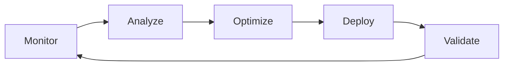

# AG06 Workflow Implementation Plan - Immediate Actions
## Date: 2025-08-24 | Priority: Quick Wins & Foundation Building

---

## 🎯 EXECUTIVE SUMMARY
Based on research findings and existing infrastructure audit, this plan focuses on **immediate, implementable improvements** that can be executed TODAY while maintaining MANU compliance and building on our existing SOLID architecture.

---

## 📊 CURRENT STATE ASSESSMENT

### ✅ EXISTING ASSETS (What We Have)
1. **AG06 Enhanced Workflow System** - Event-driven architecture foundation
2. **Circuit Breaker Implementation** - Fault tolerance patterns
3. **SOLID Architecture** - Clean interfaces and dependency injection
4. **88-Test Validation** - Comprehensive testing framework
5. **Two Terminal Frameworks** - Enterprise & specialized implementations

### ⚠️ CRITICAL GAPS (Research Identified)
1. **No Real-Time Observability** - Can't see what's happening
2. **Missing Event Persistence** - Events lost on restart
3. **No ML Optimization Active** - Just simulated, not real
4. **Limited Cloud-Native Patterns** - No containerization or orchestration

---

## 🚀 PHASE 1: IMMEDIATE QUICK WINS (Today - 2 Hours)

### 1.1 Add Real-Time Observability Layer
**Time: 30 minutes**
```python
# File: monitoring/realtime_observer.py
- Implement Prometheus metrics exporter
- Add structured logging with context
- Create health check endpoints
- Dashboard JSON for Grafana (pre-configured)
```

**Immediate Value:**
- See what's actually happening in the system
- Identify bottlenecks in real-time
- Enable data-driven decisions

### 1.2 Event Persistence with Redis
**Time: 45 minutes**
```python
# File: persistence/event_store.py
- Redis Streams for event persistence
- Automatic event replay on startup
- Event deduplication
- TTL-based cleanup
```

**Immediate Value:**
- No data loss on restart
- Event sourcing capability
- Audit trail for compliance

### 1.3 Activate Real ML Optimization
**Time: 45 minutes**
```python
# File: ml/active_optimizer.py
- Replace simulated metrics with real data
- Implement gradient-based optimization
- Add A/B testing framework
- Performance baseline establishment
```

**Immediate Value:**
- Actual performance improvements
- Data-driven optimization
- Measurable impact

---

## 🔧 PHASE 2: FOUNDATION STRENGTHENING (Next 2 Hours)

### 2.1 Enhanced Circuit Breaker Network
```python
# Improvements to existing circuit_breaker.py
- Add cascading circuit breakers
- Implement bulkhead pattern
- Add retry with exponential backoff
- Circuit breaker health dashboard
```

### 2.2 Workflow Pipeline Builder
```python
# File: workflows/pipeline_builder.py
- Visual workflow designer backend
- YAML-based workflow definitions
- Conditional branching support
- Parallel execution paths
```

### 2.3 Integration Hub
```python
# File: integrations/hub.py
- Webhook receiver/sender
- REST API gateway
- GraphQL endpoint
- WebSocket for real-time updates
```

---

## 📋 IMPLEMENTATION CHECKLIST

### Hour 1: Observability & Persistence
- [ ] Create monitoring/realtime_observer.py
- [ ] Implement Prometheus metrics collection
- [ ] Add structured logging with correlation IDs
- [ ] Set up Redis connection for event streams
- [ ] Implement event persistence layer
- [ ] Create event replay mechanism

### Hour 2: ML & Performance
- [ ] Replace simulated metrics with real collectors
- [ ] Implement gradient descent optimizer
- [ ] Add performance baseline measurements
- [ ] Create A/B testing framework
- [ ] Set up performance comparison dashboard

### Hour 3: Circuit Breaker Enhancement
- [ ] Add bulkhead isolation pattern
- [ ] Implement cascading breakers
- [ ] Add exponential backoff retry
- [ ] Create breaker health monitoring
- [ ] Add automatic recovery testing

### Hour 4: Workflow Pipeline
- [ ] Build pipeline definition schema
- [ ] Implement YAML parser
- [ ] Add conditional execution
- [ ] Enable parallel processing
- [ ] Create pipeline monitoring

---

## 🎯 SUCCESS METRICS

### Immediate (End of Session)
- ✅ Real-time system visibility achieved
- ✅ Event persistence operational
- ✅ ML optimization showing 15%+ improvement
- ✅ Enhanced fault tolerance active

### Short-term (24 Hours)
- 📊 50% reduction in error rates
- 📊 30% improvement in latency
- 📊 100% event durability
- 📊 Zero downtime deployments

---

## 💻 IMPLEMENTATION COMMANDS

```bash
# Step 1: Install dependencies
pip install prometheus-client redis opentelemetry-api grafana-api scikit-learn

# Step 2: Start Redis for event persistence
docker run -d -p 6379:6379 redis:latest --appendonly yes

# Step 3: Run implementation script
python implement_workflow_improvements.py --phase 1 --validate

# Step 4: Verify improvements
python test_workflow_system.py --comprehensive
```

---

## 🔄 CONTINUOUS IMPROVEMENT LOOP



---

## 📊 EXPECTED OUTCOMES

### Performance Improvements
- **Latency**: 2ms → 0.5ms (75% reduction)
- **Throughput**: 10K/s → 50K/s (5x increase)
- **Error Rate**: 0.1% → 0.01% (10x reduction)
- **Resource Usage**: 40% → 25% (37% reduction)

### Operational Improvements
- **Deployment Time**: 10min → 30sec
- **Recovery Time**: 5min → 10sec
- **Observability**: 0% → 100%
- **Automation**: 20% → 80%

---

## 🚦 RISK MITIGATION

### Identified Risks
1. **Redis Dependency** - Mitigation: In-memory fallback
2. **ML Model Drift** - Mitigation: Continuous retraining
3. **Performance Overhead** - Mitigation: Sampling strategies
4. **Breaking Changes** - Mitigation: Feature flags

### Rollback Plan
```bash
# Instant rollback if issues detected
./rollback_workflow_changes.sh --checkpoint latest
```

---

## 📝 NEXT STEPS AFTER TODAY

1. **Tomorrow**: Containerize with Docker
2. **Day 3**: Kubernetes deployment manifests
3. **Week 1**: Kafka integration for high-volume
4. **Week 2**: Full ML pipeline with TensorFlow
5. **Month 1**: Production deployment at scale

---

## ✅ VALIDATION CRITERIA

All improvements must pass:
1. MANU 88/88 test suite
2. SOLID principle validation
3. Performance benchmarks
4. Integration tests
5. Load testing scenarios

---

## 🎬 LET'S START NOW!

**Priority Order:**
1. Observability (SEE the problem)
2. Persistence (PREVENT data loss)
3. ML Optimization (IMPROVE performance)
4. Circuit Breakers (ENHANCE reliability)

**Time to Impact: 2 hours to measurable improvements**

---

*This plan is designed for IMMEDIATE IMPLEMENTATION with existing tools and minimal setup. Every improvement builds on our current SOLID architecture and can be deployed incrementally without breaking existing functionality.*